**MykoPizza** is an dynamic web application developed as a student project, showcasing capabilities of modern web development technologies. Leveraging the powerful **NextJS 14** framework for its server-side rendering and static site generation capabilities, the app ensures a fast and seamless user experience. The robust and scalable **MongoDB** database is utilized for efficient data management, allowing for smooth handling of user and menu data. The user interface is elegantly styled using **Tailwind CSS**, providing a visually appealing and highly customizable design.

This is a [Next.js](https://nextjs.org/) project bootstrapped with [`create-next-app`](https://github.com/vercel/next.js/tree/canary/packages/create-next-app).

## Getting Started

First, run the development server:

```bash
npm run dev
# or
yarn dev
# or
pnpm dev
# or
bun dev
```

Open [http://localhost:3000](http://localhost:3000) with your browser to see the result.

You can start editing the page by modifying `app/page.js`. The page auto-updates as you edit the file.

This project uses [`next/font`](https://nextjs.org/docs/basic-features/font-optimization) to automatically optimize and load Inter, a custom Google Font.

## Learn More

To learn more about Next.js, take a look at the following resources:

- [Next.js Documentation](https://nextjs.org/docs) - learn about Next.js features and API.
- [Learn Next.js](https://nextjs.org/learn) - an interactive Next.js tutorial.

You can check out [the Next.js GitHub repository](https://github.com/vercel/next.js/) - your feedback and contributions are welcome!

## Deploy on Vercel

The easiest way to deploy your Next.js app is to use the [Vercel Platform](https://vercel.com/new?utm_medium=default-template&filter=next.js&utm_source=create-next-app&utm_campaign=create-next-app-readme) from the creators of Next.js.

Check out our [Next.js deployment documentation](https://nextjs.org/docs/deployment) for more details.

## Using the app

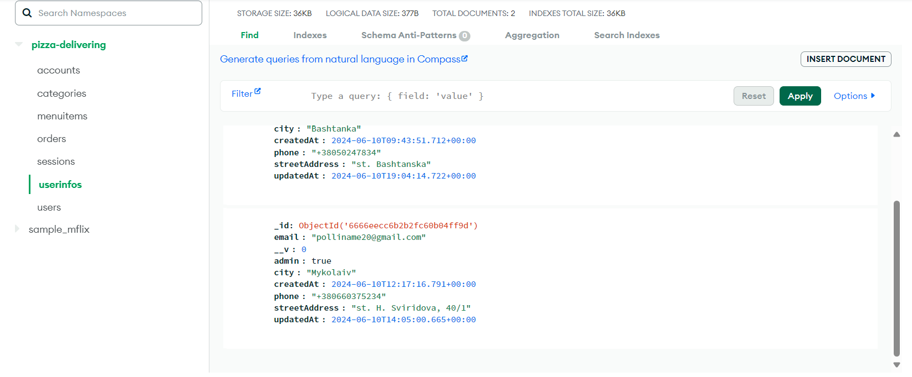

The application has **two options for use**:

-Administrative page

-User-client

To use the administrative page, you must have the status "admin", which is **assigned manually in the userInfos data collection** in MongoDB.
With **"admin"** status, the user can add categories:

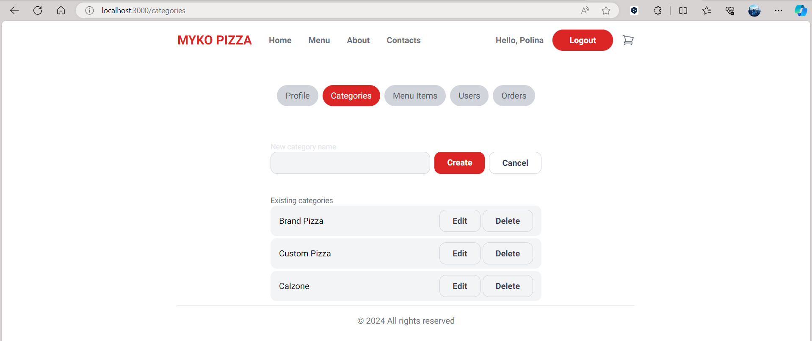

Add dishes to the menu (pizzas):

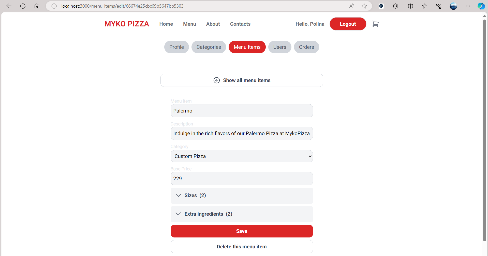

Edit information about service users:

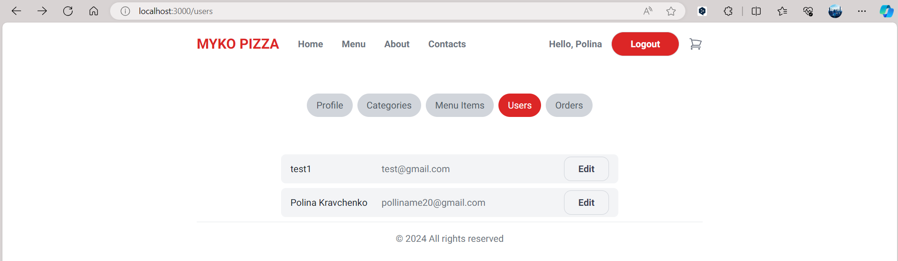

In the application, you can order dishes from the menu, which is previously added by the **"admin"**. When ordering, the user can choose the size of the pizza, additional ingredients, etc.

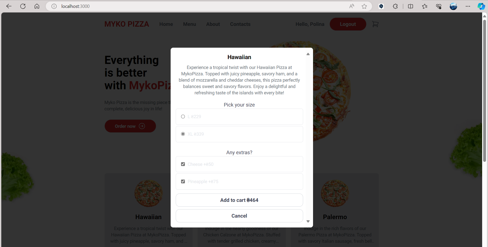

All dishes on the menu are divided into categories:

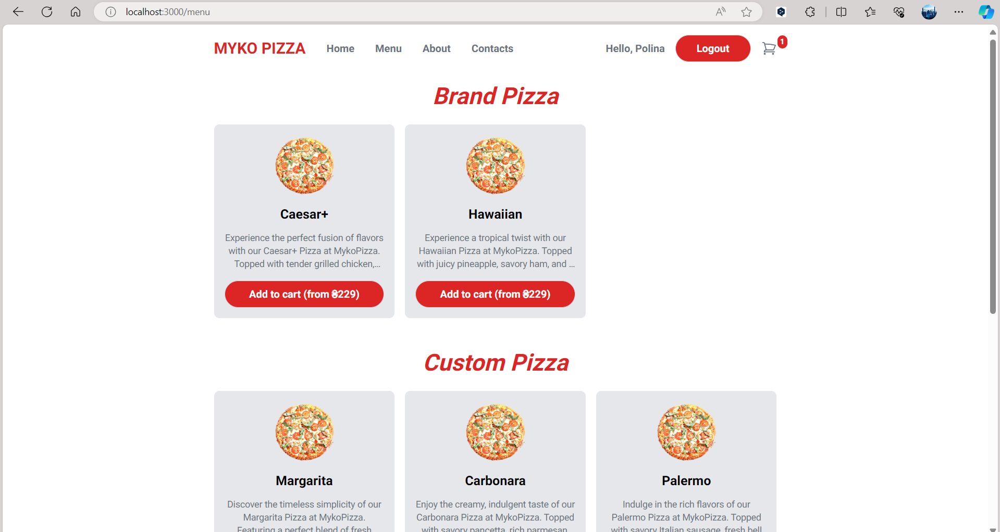
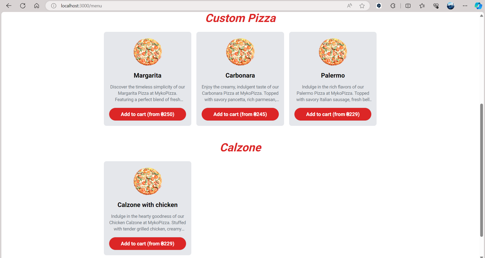

Next, the user can go to the cart, where he or she will see the selected dishes for ordering, as well as a form for entering information for delivery:

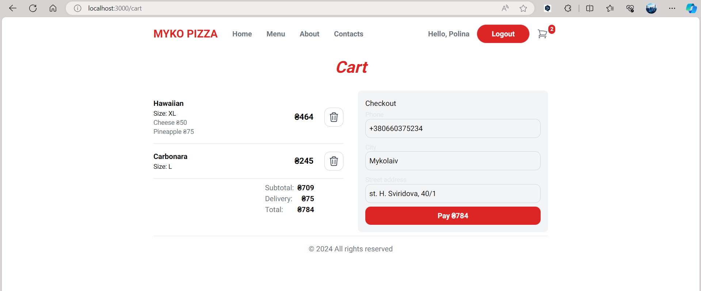

## Swagger UI

To view the Swagger UI, an extension was installed **in Visual Studio Code - Swagger Previewer**.

Created **route.js** file for Swagger. A **swagger.yaml** file was also created, which describes all the components, object models used to manage data in various application **endpoints**.

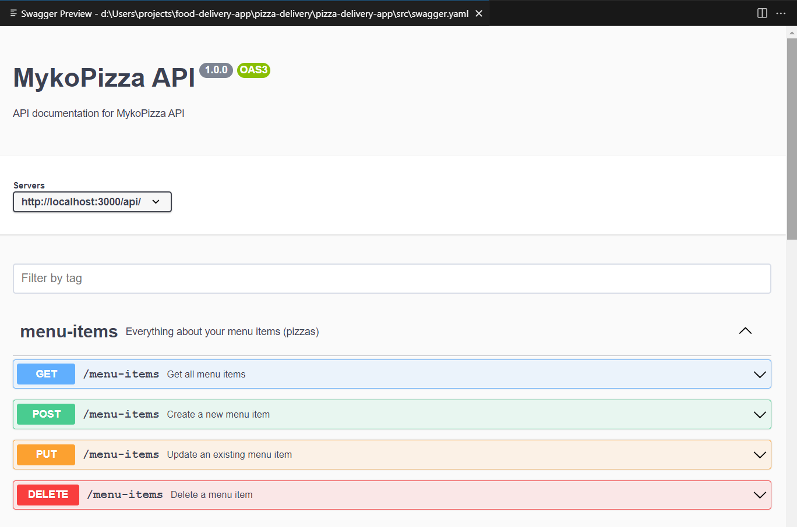
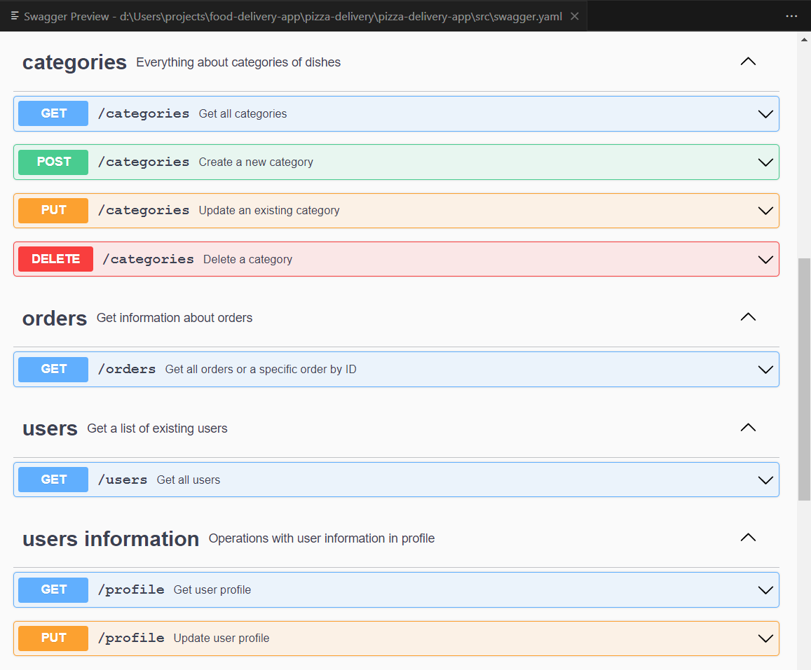
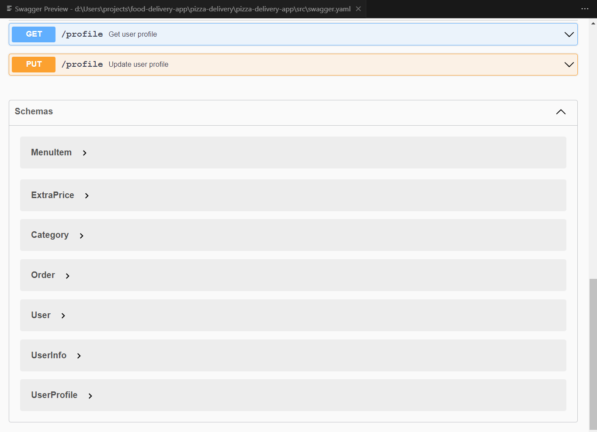
